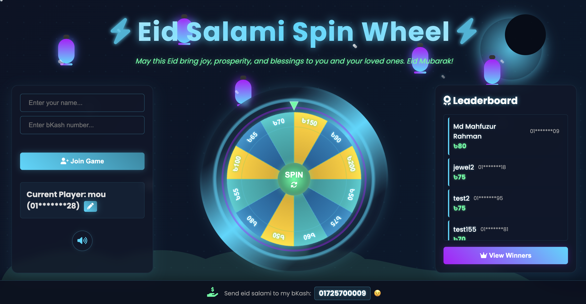
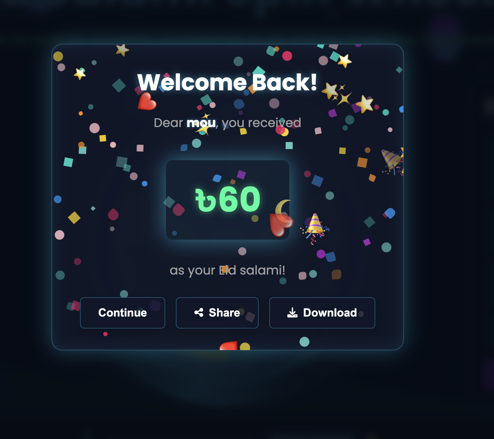

# Eid Salami Spin Wheel 🎡

A futuristic Eid-themed web application where users can spin a wheel to win virtual Eid salami (monetary gifts). The application features a beautiful, interactive UI with animations, sound effects, and a real-time leaderboard.



## ✨ Features

- **Futuristic UI Design**: Modern interface with glowing neon elements, floating animations, and particle effects
- **Interactive Spin Wheel**: Smooth spinning animation with dynamic prize selection
- **Player Registration**: Players can register with their name and bKash number
- **Score Tracking**: Automatic saving of player scores in a database
- **Real-time Leaderboard**: See top players and their scores
- **Win Celebrations**: Beautiful confetti and animations when winning prizes
- **Share Functionality**: Players can share or download their winning images
- **Responsive Design**: Fully responsive for mobile, tablet and desktop devices
- **Sound Effects**: Interactive audio feedback with mute option

## 🎮 How to Play

1. Enter your name and bKash number in the player registration form
2. Click "Join Game" to participate
3. Press the "SPIN" button to spin the wheel
4. View your prize and celebrate your win!
5. Share your win with friends or download a celebratory image



## 💻 Technical Details

### Frontend
- Pure HTML, CSS, and JavaScript
- Canvas API for wheel animations and graphics
- Web Audio API for sound effects
- Responsive design using CSS flexbox and media queries

### Backend
- Node.js with Express server
- SQLite database for storing player information and scores
- RESTful API endpoints for user management and score tracking

### Requirements
- Node.js (v14 or higher)
- npm (v6 or higher)
- Modern web browser with JavaScript enabled

## 🚀 Getting Started

1. Clone the repository
   ```bash
   git clone <repository-url>
   cd lucky-spin-wheel
   ```

2. Install dependencies
   ```bash
   npm install
   ```

3. Start the server
   ```bash
   node server.js
   ```

4. Open your browser and navigate to
   ```
   http://localhost:3000
   ```

## 📱 Mobile Experience

The application is fully responsive and works well on mobile devices. The layout changes to a vertical design on smaller screens, with the player section at the top, wheel in the middle, and leaderboard at the bottom.

## 🔊 Sound Effects

The game includes sound effects for:
- Spinning the wheel
- Winning prizes

Players can mute/unmute sounds using the volume button in the player section.

## 🔄 API Endpoints

The server provides the following API endpoints:

- `POST /api/users` - Register a new user
- `GET /api/users` - Get all registered users
- `PUT /api/users/:id/score` - Update a user's score
- `PUT /api/users/:id/name` - Update a user's name
- `GET /api/winners` - Get top winners

## 🛠️ Project Structure

- `index.html` - Main HTML structure
- `style.css` - All styles and animations
- `script.js` - Client-side JavaScript logic
- `server.js` - Node.js Express server
- `assets/` - Sound files and other assets
- `screenshots/` - Application screenshots

## 📷 Screenshots

### Main Screen


### Win Dialog


### Eid Salami Info


## ❤️ Support the Developer

If you enjoyed this project, you can send Eid salami to the developer's bKash wallet: **01725700009**

---

Happy Eid! 🌙 Spin the wheel and enjoy your virtual Eid salami! 🎉

# Production Deployment with PM2

This application is configured to use PM2 process manager for production deployment.

## PM2 Features Used

- **Process Management**: Keeps the application running continuously
- **Auto-restart**: Automatically restarts the app if it crashes
- **Environment Variables**: Proper NODE_ENV configuration for production
- **Monitoring**: Resource usage monitoring and logs management

## Deployment Instructions

1. Make sure PM2 is installed globally:
   ```bash
   npm install -g pm2
   ```

2. Run the deployment script:
   ```bash
   ./deploy.sh
   ```

   This script will:
   - Install dependencies
   - Build minified assets (CSS and JavaScript)
   - Update HTML to use the minified files
   - Set production mode
   - Start or reload the application with PM2

3. Alternatively, you can use the npm scripts:
   ```bash
   # Start in production mode
   npm run prod
   
   # Reload running instance
   npm run reload
   
   # Stop the application
   npm run stop
   
   # Monitor resource usage
   npm run monit
   
   # View logs
   npm run logs
   
   # Check status
   npm run status
   ```

## Ecosystem Configuration

The PM2 configuration is stored in `ecosystem.config.js` with the following settings:
- Single instance mode
- Auto-restart on crash
- Memory limit of 500MB
- Production environment variables

## Reverting to Development Mode

To switch back to development mode:
```bash
./dev.sh
npm run dev
```

# Troubleshooting

## SQLite3 Module Error

If you encounter the following error when running the application:

```
Error: [...]/node_modules/sqlite3/build/Release/node_sqlite3.node: invalid ELF header
```

This error occurs when the SQLite3 native module was compiled for a different architecture or operating system than the one you're running on. This commonly happens when:

- Moving code between different operating systems (e.g., from macOS to Linux)
- Deploying to a production environment with a different architecture
- Using Docker or virtual environments

### Solution:

Rebuild the SQLite3 module for your current environment:

```bash
npm rebuild sqlite3
```

If that doesn't resolve the issue, try completely reinstalling the node modules:

```bash
rm -rf node_modules
npm install
```

For persistent issues, you may need to explicitly install SQLite3 with the correct build flags:

```bash
npm install sqlite3 --build-from-source
```

### Production Deployment Note

When deploying to production servers, always rebuild native modules to ensure compatibility with the server environment:

```bash
# After deploying code to your server
npm rebuild
# Then start the application
npm start
# Or with PM2
npm run prod
```

# Nginx Setup for Production

For production deployment, it's recommended to use Nginx as a reverse proxy in front of the Node.js application. This provides several benefits:

- Improved performance for static file serving
- SSL/TLS termination
- Load balancing capabilities
- Security layer

## Quick Setup

A setup script is included to automate the Nginx configuration process:

```bash
# Run as root or with sudo
sudo ./setup-nginx.sh
```

This script will:
1. Install Nginx if not already installed
2. Create and enable a site configuration for your domain
3. Set up proper proxy settings to forward requests to your application
4. Configure performance optimizations like gzip compression and caching
5. Optionally set up SSL with Let's Encrypt

## Manual Configuration

If you prefer to set up Nginx manually, use the provided configuration template:

```nginx
server {
    listen 80;
    server_name your-domain.com www.your-domain.com;  # Replace with your domain

    access_log /var/log/nginx/lucky-wheel-access.log;
    error_log /var/log/nginx/lucky-wheel-error.log;

    location / {
        proxy_pass http://localhost:3000;
        proxy_http_version 1.1;
        proxy_set_header Upgrade $http_upgrade;
        proxy_set_header Connection 'upgrade';
        proxy_set_header Host $host;
        proxy_set_header X-Real-IP $remote_addr;
        proxy_set_header X-Forwarded-For $proxy_add_x_forwarded_for;
        proxy_set_header X-Forwarded-Proto $scheme;
        proxy_cache_bypass $http_upgrade;
    }

    # Additional optimizations are included in the full configuration
}
```

Save this to `/etc/nginx/sites-available/lucky-wheel` and create a symbolic link to enable it:

```bash
sudo ln -s /etc/nginx/sites-available/lucky-wheel /etc/nginx/sites-enabled/
sudo nginx -t
sudo systemctl restart nginx
```
