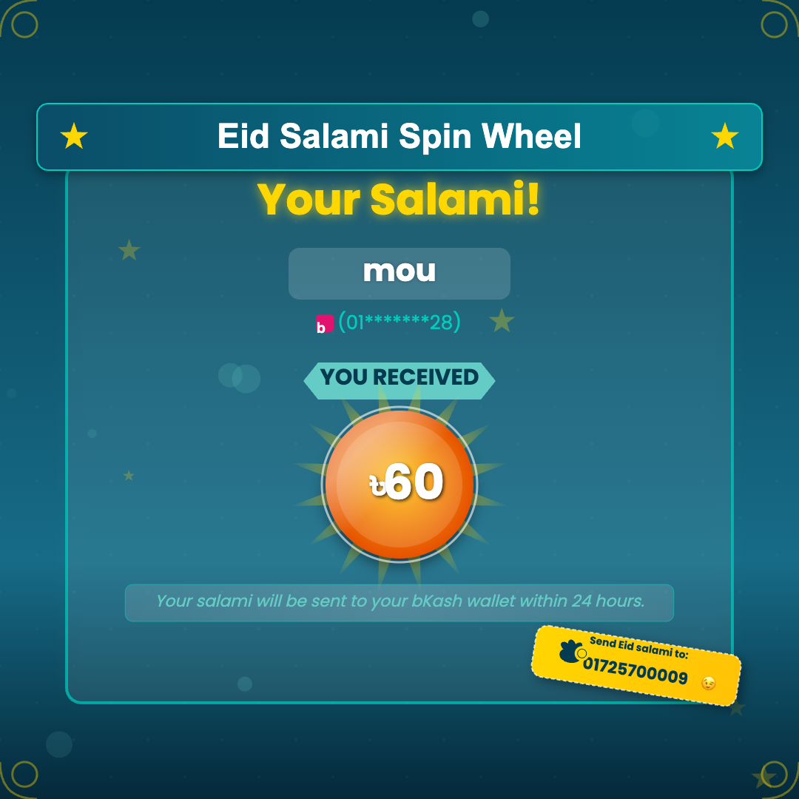

# Eid Salami Spin Wheel 🎡

A futuristic Eid-themed web application where users can spin a wheel to win virtual Eid salami (monetary gifts). The application features a beautiful, interactive UI with animations, sound effects, and a real-time leaderboard.


## ✨ Features

- **Futuristic UI Design**: Modern interface with glowing neon elements, floating animations, and particle effects
- **Interactive Spin Wheel**: Smooth spinning animation with dynamic prize selection
- **Player Registration**: Players can register with their name and bKash number
- **Score Tracking**: Automatic saving of player scores in a database
- **Real-time Leaderboard**: See top players and their scores
- **Win Celebrations**: Beautiful confetti and animations when winning prizes
- **Share Functionality**: Players can share or download their winning images
- **Responsive Design**: Fully responsive for mobile, tablet and desktop devices
- **Sound Effects**: Interactive audio feedback with mute option

## 🎮 How to Play

1. Enter your name and bKash number in the player registration form
2. Click "Join Game" to participate
3. Press the "SPIN" button to spin the wheel
4. View your prize and celebrate your win!
5. Share your win with friends or download a celebratory image


## 💻 Technical Details

### Frontend
- Pure HTML, CSS, and JavaScript
- Canvas API for wheel animations and graphics
- Web Audio API for sound effects
- Responsive design using CSS flexbox and media queries

### Backend
- Node.js with Express server
- SQLite database for storing player information and scores
- RESTful API endpoints for user management and score tracking

### Requirements
- Node.js (v14 or higher)
- npm (v6 or higher)
- Modern web browser with JavaScript enabled

## 🚀 Getting Started

1. Clone the repository
   ```bash
   git clone <repository-url>
   cd lucky-spin-wheel
   ```

2. Install dependencies
   ```bash
   npm install
   ```

3. Start the server
   ```bash
   node server.js
   ```

4. Open your browser and navigate to
   ```
   http://localhost:3000
   ```

## 📱 Mobile Experience

The application is fully responsive and works well on mobile devices. The layout changes to a vertical design on smaller screens, with the player section at the top, wheel in the middle, and leaderboard at the bottom.

## 🔊 Sound Effects

The game includes sound effects for:
- Spinning the wheel
- Winning prizes

Players can mute/unmute sounds using the volume button in the player section.

## 🔄 API Endpoints

The server provides the following API endpoints:

- `POST /api/users` - Register a new user
- `GET /api/users` - Get all registered users
- `PUT /api/users/:id/score` - Update a user's score
- `PUT /api/users/:id/name` - Update a user's name
- `GET /api/winners` - Get top winners

## 🛠️ Project Structure

- `index.html` - Main HTML structure
- `style.css` - All styles and animations
- `script.js` - Client-side JavaScript logic
- `server.js` - Node.js Express server
- `assets/` - Sound files and other assets
- `screenshots/` - Application screenshots

## 📷 Screenshots

### Main Screen


### Win Dialog


### Eid Salami Info


## ❤️ Support the Developer

If you enjoyed this project, you can send Eid salami to the developer's bKash wallet: **01725700009**

---

Happy Eid! 🌙 Spin the wheel and enjoy your virtual Eid salami! 🎉

# Production Deployment with PM2

This application is configured to use PM2 process manager for production deployment.

## PM2 Features Used

- **Process Management**: Keeps the application running continuously
- **Auto-restart**: Automatically restarts the app if it crashes
- **Environment Variables**: Proper NODE_ENV configuration for production
- **Monitoring**: Resource usage monitoring and logs management

## Deployment Instructions

1. Make sure PM2 is installed globally:
   ```bash
   npm install -g pm2
   ```

2. Run the deployment script:
   ```bash
   ./deploy.sh
   ```

   This script will:
   - Install dependencies
   - Build minified assets (CSS and JavaScript)
   - Update HTML to use the minified files
   - Set production mode
   - Start or reload the application with PM2

3. Alternatively, you can use the npm scripts:
   ```bash
   # Start in production mode
   npm run prod
   
   # Reload running instance
   npm run reload
   
   # Stop the application
   npm run stop
   
   # Monitor resource usage
   npm run monit
   
   # View logs
   npm run logs
   
   # Check status
   npm run status
   ```

## Ecosystem Configuration

The PM2 configuration is stored in `ecosystem.config.js` with the following settings:
- Single instance mode
- Auto-restart on crash
- Memory limit of 500MB
- Production environment variables

## Reverting to Development Mode

To switch back to development mode:
```bash
./dev.sh
npm run dev
```
